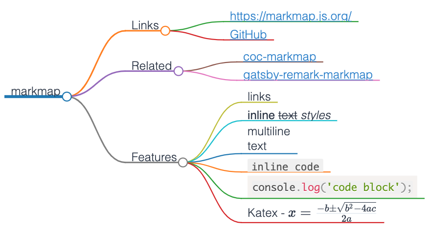

# Obsidian Markmap

A [markmap](https://markmap.js.org/) plugin for [Obsidian](https://obsidian.md/).

## Example

```markdown
# markmap

## Links

- <https://markmap.js.org/>
- [GitHub](https://github.com/gera2ld/markmap)

## Related

- [coc-markmap](https://github.com/gera2ld/coc-markmap)
- [gatsby-remark-markmap](https://github.com/gera2ld/gatsby-remark-markmap)

## Features

- links
- **inline** ~~text~~ *styles*
- multiline
  text
- `inline code`
-
    ```js
    console.log('code block');
    ```
- Katex - $x = {-b \pm \sqrt{b^2-4ac} \over 2a}$
```



## Custom build

build with `yarn`:

```bash
foo@bar:~/obsidian-markmap$ yarn install
foo@bar:~/obsidian-markmap$ yarn build
```

or build with `npm`:

```bash
foo@bar:~/obsidian-markmap$ npm install
foo@bar:~/obsidian-markmap$ npm run build
```

then, copy `dist/*` to your vault:

```bash
foo@bar:~/obsidian-markmap$ mkdir -p ${your_vault_path}/.obsidian/plugins/obsidian-markmap/
foo@bar:~/obsidian-markmap$ copy dist/* ${your_vault_path}/.obsidian/plugins/obsidian-markmap/
```

finally, enable the plugin `Obsidian Markmap`.

## Maintainers

[@hypc](https://github.com/hypc)

## License

[MIT](https://github.com/hypc/obsidian-markmap/blob/master/LICENSE) © hypc
